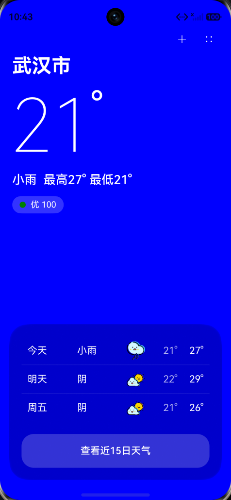

# AI Weather（HarmonyOS ArkTS）

一款 **仿小米系统天气** 的 HarmonyOS 天气应用，使用 ArkTS / ArkUI 构建，主打“沉浸式 UI + 轻量交互”，支持 **IP 定位获取城市**、**实时天气与未来预报**、**城市管理**、**下拉刷新**、以及简单的 **新闻 / 我的** 页面入口。

> 数据来源：高德开放平台（Web 服务 API）

## 预览

> 项目截图位于 `entry/src/main/resources/rawfile/screenshot/1.png`

## 功能特性

- **IP 定位**：启动后通过高德 `v3/ip` 接口获取当前城市与 `adcode`
- **实时天气**：调用高德天气接口（`extensions=base`）获取当前温度等信息
- **天气预报**：调用高德天气接口（`extensions=all`）获取预报信息，并在首页展示近 3 日
- **下拉刷新**：支持手动刷新当前位置天气，并带“更新中/更新完成”状态提示
- **网络状态检测与引导**：无网络时给出提示，可跳转系统 Wi‑Fi 设置页
- **城市管理**：
  - 城市搜索（基于本地 `rawfile/city_code.json` 城市字典）
  - 热门城市快捷添加
  - 已添加城市列表展示
  - 点击城市一键切换到首页
  - 侧滑删除城市
  - 本地持久化保存（Preferences）
- **动态背景**：根据天气文字（晴/阴/多云/小雨/大雨）切换渐变背景
- **页面入口**：首页右上角菜单可进入“新闻”“我的”页面

## 页面结构

- `pages/StartPage`：启动页（带字体与退场动画），结束后进入首页
- `pages/Index`：主页（天气展示、刷新、菜单入口）
- `pages/City_Management`：城市管理页（搜索/添加/删除/切换城市）
- `pages/News`：新闻列表（示例静态数据）
- `pages/User`：个人中心（示例静态信息与菜单项）

## 技术栈

- **HarmonyOS / ArkTS（ArkUI）**
- 网络请求：`@ohos.net.http`
- 网络检测：`@ohos.net.connection`
- 本地存储：`@ohos.data.preferences`
- 页面导航：`Navigation` + `NavPathStack`

## 权限

项目在 `entry/src/main/module.json5` 中声明了主要权限：

- `ohos.permission.INTERNET`
- `ohos.permission.GET_NETWORK_INFO`
- `ohos.permission.APPROXIMATELY_LOCATION`
- `ohos.permission.LOCATION`

> 说明：本项目的“定位”默认走 **IP 定位**（无需 GPS），但仍预留了定位相关权限配置，便于后续扩展。

## 数据与资源

- 城市字典：`entry/src/main/resources/rawfile/city_code.json`
- 截图：`entry/src/main/resources/rawfile/screenshot/1.png`
- 天气图标资源：`entry/src/main/resources/base/media/` 下的 `ic_weather_*`

## 如何运行

1. 使用 DevEco Studio 打开本项目
2. 确认设备/模拟器环境可联网
3. 运行 `entry` 模块

> 如果你要替换为自己的高德 Key：请在 `entry/src/main/ets/pages/Index.ets` 中找到 `AMAP_KEY` 并替换。

## 路线图（可选）

- 接入真实新闻 API（替换当前静态数据）
- “15 日天气”页面补齐（当前按钮入口已预留）
- 支持手动切换主题/背景动效
- 头像上传与用户资料编辑

## License

MIT License. See [`LICENSE`](LICENSE).
